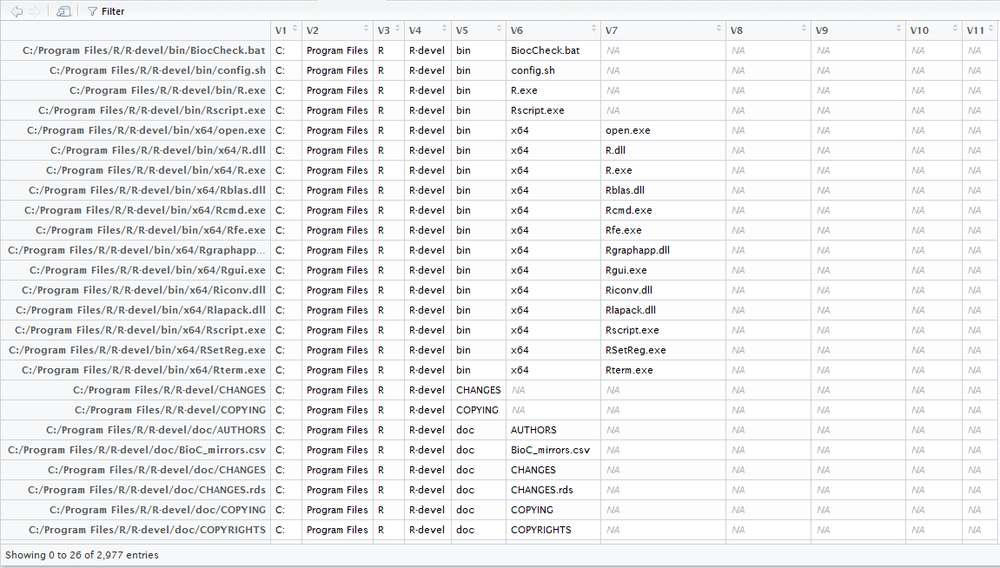

<!--
%\VignetteEngine{knitr::rmarkdown}
%\VignetteIndexEntry{1. Introduction}
-->

```{r, Setup, echo = FALSE, results = "hide"}
set.seed(19790801)
knitr::opts_chunk$set(error = FALSE)
```

## Convenient Wrappers for Base-R Functions

There are lots of functions in base-R for working with files and directories. Unfortunately, some of them are a little bit annoying to work with.  For example, the function names, and the form in which paths are returned, are inconsistent.  For example

```{r, inconsistent_return}
tempdir()
R.home()
```

*pathological* contains standardized wrappers to these functions. These return absolute, unabbreviated paths.  You can choose whether you want back or forward slashes to separate directory levels.

```{r, standardized_wrappers}
library(pathological)
temp_dir()
r_home()
```

These wrappers are also vectorized.

```{r, vectorized_wrappers}
r_home(c("home", "bin", "share"), c("", "i386", "zoneinfo"))
```

There are several wrapper functions available in *pathological*.

```{r, wrapper_data, echo = FALSE, results = "asis"}
wrapper_data <- data.frame(
  "base/utils" = c("choose.files, file.choose", "choose.dir", "dir.create", "file.create", "file.copy", ".libPaths", "R.home", "Sys.which", "system.file", "tempdir", "tempfile"),
  pathological = c("choose_files", "choose_dir", "copy_dir", "create_dirs", "create_files", "get_libraries", "r_home", "sys_which", "system_file", "temp_dir", "temp_file"),
  stringsAsFactors = FALSE
)
knitr::kable(wrapper_data)
```

The underlying function for creating the standardized paths is `standardize_path`, with `standardise_path` also available for fans of British English.

## Getting Parts of Files

There are several functions for getting a parts of a file name , or parts of a path. `decompose_path` splits a path into the directory name, file name without extension, and file extension.  The results are returned as a data frame, and multiple dots in the file extension are correctly dealt with.  In the following example, the `with_dir` function from the *withr* package is used to temporarily change the working directory, to better demonstrate the `dirname` column returned by `decompose_path`.

```{r, decompose_path}
x <- c("foo.tgz", "bar.tar.gz", "baz")
withr::with_dir(
  temp_dir(),
  decompose_path(x)
)
```

There are several convenience functions that retrieve build on `decompose_path`.

- `get_extension` returns only the file extension.
- `strip_extension` returns the file name without the extension.
- `replace_extension` replaces the file extension with a new one.
- `recompose_path` undoes the effects of `decompose_path`.

`split_path` splits file paths into directory components, returning a list of character vectors, or a matrix.

```{r, split_path}
split_path(r_home())
split_path(r_home(), simplify = TRUE)
```

`split_dir` is a shortcut for `dir` + `split_path`, with defaults to make it easy to `View` the contents of a directory structure.


```{r, split_dir, results = "hide"}
split_dir(r_home())
```



## Startup files

On startup, you can customize R's behaviour by running an R Profile script, or setting environment variables in an R Environ script. the `?Startup` help page details the convoluted process of how it determines which files to run.  To save worrying about the details, *pathological* has some functions that return the paths to these files. `r_profile_site` returns the path to the site-level R Profile file.  `r_profile` returns the user-level file.  If a suitable file cannot be found, `NA` is returned.

```{r, r_profile_site}
r_profile_site()
r_profile()
```

`r_environ_site` and `r_environ` are the equivalent functions for site and user-level R Environ files, respectively.

## Windows-Specific Functionality

There are a few functions for use with Windows file paths.

- `is_windows_drive` returns \code{TRUE} wherever the input paths are a letter followed by a colon, and optionally a forward or back slash.
- `get_windows_drive` returns the drive of the input paths.
- `cygwinify_path` converts a p[ath to a form that cygwin is happy with.


## Other Miscellanea

- `rstudio_project_dir` returns the directory of the current project.
- `parent_dir` returns the parent directory of the input.
- `os_path` returns the operating system `PATH` environment varaible as a character vector.
